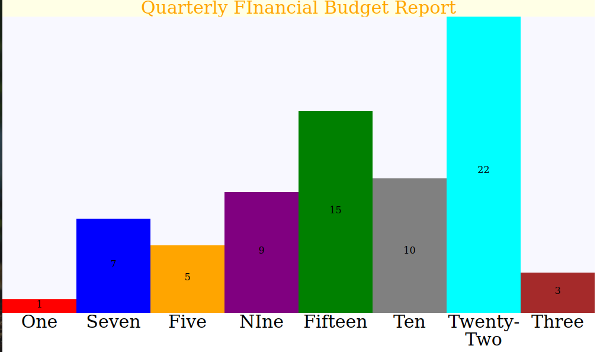

# bar-chart-project
Please note the default branch is **'main'**
## About
This is a stretch project for LHL's prep work. I created an API which gives users a tool to create beautiful bar charts embedded in their web pages. JQuery is used to manipulate the DOM. Please include the JQuery **node_modules** to your repository after you clone it. Current released version is **v1.0**.

## v1.0

### How to use
Call the function *drawBarChart(data, options, element)*
*data* is a single array of values corresponding to your y-axis bar chart values
*options* is a Javascript object containing extra functionalities you want to add such as title, bar color..etc
*element* is the parent HTML element you want to embed the bar chart into

*data*, *element* are mandatory parameters.
*options* is an optional parameter.

#### List of Available Options
The structure of the *options* object is

```options = {color: [string1, string2, ...], showData: [true/false, string1], title: [string1, font-size(string value), color(string value)], xLabel: [string1, string2, string3, ...]}```

The color property sets the colors for each bar. Color is optional and the default is black.

The showData property labels each bar with their values. This property can be toggled on/off by setting true/false. String1 can take 'up', 'down', or 'middle' and positions the labels on the bars respectively.

The title property sets the title. String1 sets the name. Font-size is a string value which sets the size of the title. Color is a string value which sets the color of the title. By default, the font-size is 30px and color is black.

The xLabel property sets labels for the x-axis and takes in an array of strings correponding to the label names you want to give.

## Future Roadmap
- [] Implement labels for the y-axis at certain values
- [] Implement the ability to space out each bars
- [] Implement stacked bar charts
- [] Clean up the UI; Steer away from using pixel values in CSS

## List of Resources Used
JQuery - https://www.w3schools.com/jquERy

CSS Flexbox
